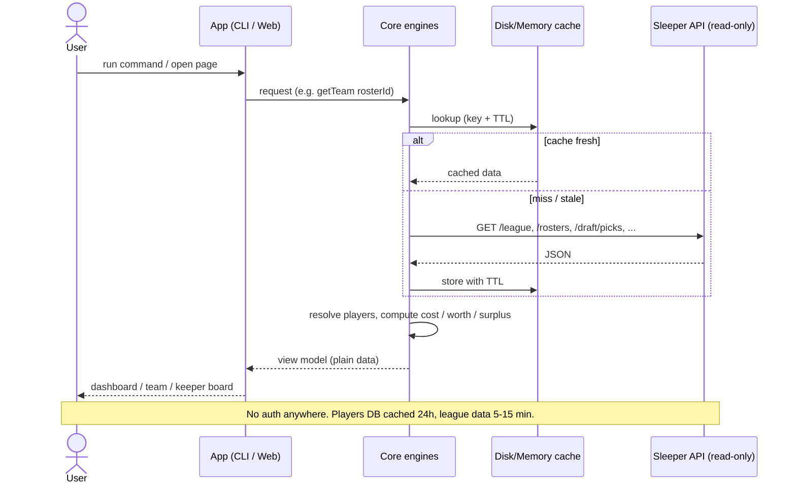
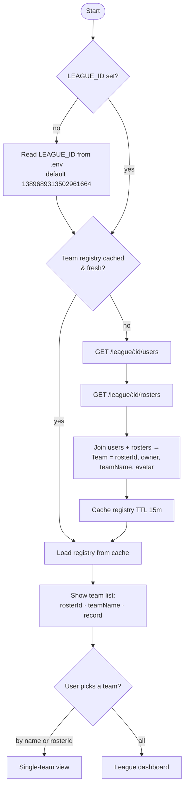
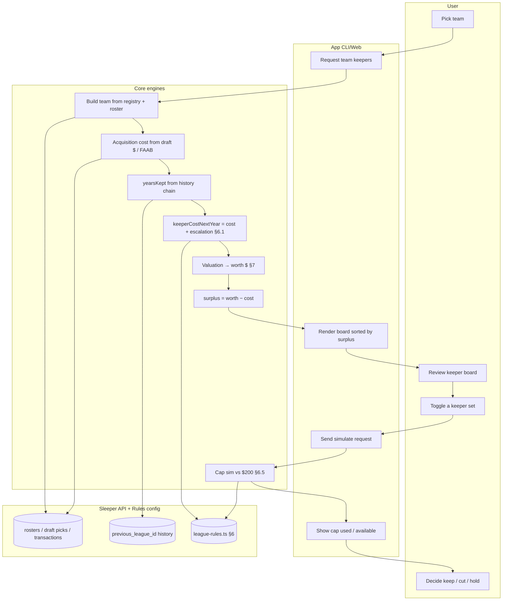
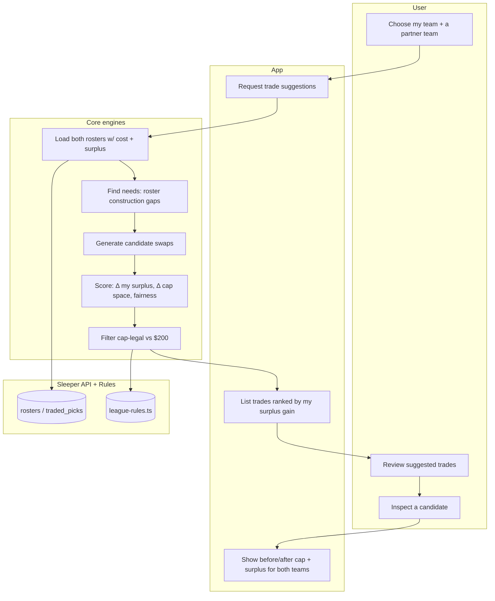
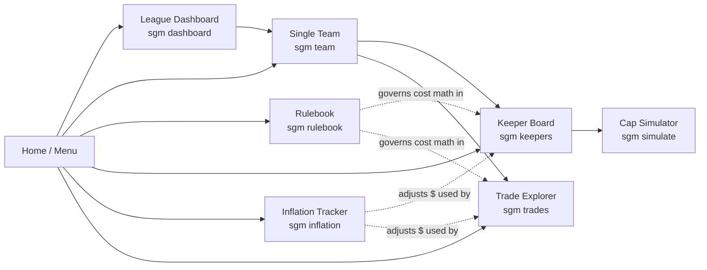

# Sleeper GM — Flow & Interaction Diagrams (v0.1)

Companion to [spec.md](spec.md). These map how a user moves through the app and how the pieces talk to
each other. They are written to hold true for **both** the CLI (Phase 1) and the later web UI — the
"App" lane is whichever front-end is present; the **core engines** and **Sleeper API** lanes are
identical either way.

Rendered as Mermaid (GitHub / most Markdown viewers render these natively).

---

## 1. System interaction — data flow with caching

How any request flows from the user to Sleeper and back, and where caching short-circuits it.

---

## 2. Onboarding & team selection (the "team registry")

How the app learns the 12 teams once, so the user can then focus on a single team. This is the concrete
form of "gather and store team_ids as well as the league id."

---

## 3. Keeper decision — swimlane

The central user journey: from picking a team to deciding who to keep, with cap and surplus in view.
Lanes = who does the work.

---

## 4. Trade exploration — swimlane

---

## 5. Overall navigation map

The menu/nav the user moves through — identical concept for the CLI menu and the web nav.

---

### Legend / conventions
- **App** lane = CLI in Phase 1, React later — same downstream flow.
- **Core engines** = pure, unit-tested functions ([spec.md §5](spec.md)).
- Dashed arrows = "influences/governs," solid = direct call/data flow.
- `❓` rules (escalation §6.1, rookie cost §6.4) plug in at the **Rules config** node; the flows already
  account for them so implementation isn't blocked on the numbers.
